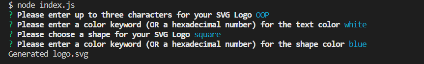
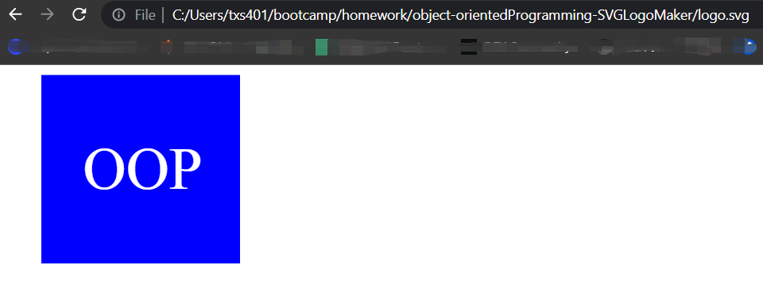

# object-orientedProgramming-SVGLogoMaker

  ## Description

  This is a Node.js command-line application that takes in user input to generate a logo and save it as an SVG file. The application prompts the user to select a color and shape, provide text for the logo, and save the generated SVG to a .svg file. This application uses [Jest](https://www.npmjs.com/package/jest) for running the unit tests and [Inquirer](https://www.npmjs.com/package/inquirer/v/8.2.4) for collecting input from the user. 

  ## Table of Contents
  
  - [Usage](#usage)
  - [Video](#video)
  - [Technologies](#technologies)
  - [Installation](#installation)
  - [License](#license)
  - [Questions](#questions)

  ## Usage

  Invoke the application by using the following command:
  ```bash
  node index.js
  ```
  Then you will be prompted to select the text, text color, shape, and shape color for your SVG logo.

  * For the text, you need to enter up to three characters.
  * For the text color, you need to enter a color keyword or a hexadecimal number.
  * For the shape, you will be presented with a list of shapes to choose from: circle, triangle, and square.
  * For the shape color, you also need to enter a color keyword or a hexadecimal number.

  Once you have entered input for all the prompts, an SVG file is created named `logo.svg`, and you will see "Generated logo.svg" printed in the command line. 

  

  When you open the `logo.svg` file in a browser, you will see a 300x200 pixel image that matches the criteria you entered.<br>
  <br>
  

  ## Video

  Please have a look at the walkthrough video demonstrating the functionality of this application:

  Video link: https://drive.google.com/file/d/1K9jzh2wczi4RxGjmerCNthOpAiVPmAuQ/view
  
  ## Technologies

  * [Jest](https://www.npmjs.com/package/jest)
  * [Inquirer package](https://www.npmjs.com/package/inquirer/v/8.2.4)

  ## Installation

  N/A

  ## License

  N/A

  ## Questions

  If you have additional questions, feel free to reach me through github or email.

  Github: https://github.com/xybai0103
  
  Email: xueyin0103@gmail.com